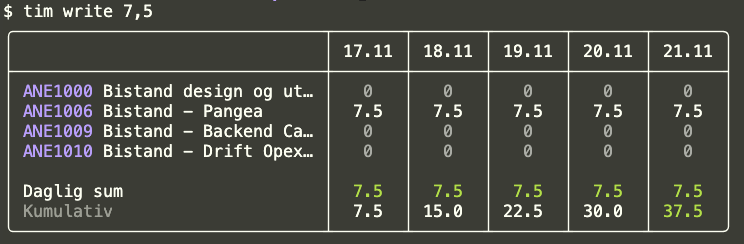

# tim

timeføring cli

```terminal
$ tim --help
Usage: [command] [-h|--help] [--version]

Commands:
  curl                curl '/employees?id=eq.1'
  emp                 Hent en spesifikk ansatts detaljer
  emp list, emp ls    Hent alle ansatte fra Floq
  emp me              Hent mine ansatt-detaljer
  get-default         Henter default-prosjektet ditt
  list, ls            Lister førte timer
  login               Logger inn via browser
  logout              Logger deg ut lokalt
  set-default         Setter et prosjekt som default til timeføring
  write               Registrerer nye timer
```




## install

1. MacOS og Linux
2. Windows

*MacOS/Linux*


Alt 1 - _Homebrew_


```bash
brew tap blankoslo/tools git@github.com:blankoslo/homebrew-tools.git
brew install blankoslo/tools/tim
```

Alt 2 - Manuelt

Bruk filene fra [releases](https://github.com/blankoslo/tim/releases/latest). Last ned siste versjon og hiv den i en mappe som er i PATH-en din.


*Windows*
<details>

<summary>Windows-greier her</summary>

Flere muligheter. Dersom man bruker WSL, så kan man bruke Homebrew. Se over.

Ellers har man 3 muligheter

1 - .NET tool

 (krever .NET 9 eller .NET 10):

Et _GitHub Classic Token_  kan du opprette [her](https://github.com/settings/tokens). Husk å gi den `read:packages` og litt varighet da

```bash
$ dotnet nuget add source "https://nuget.pkg.github.com/blankoslo/index.json" \
 --username dontcare \ 
 --password <GH_PAT> \ 
 --store-password-in-clear-text 
 --name github \ 
```

```bash
$ dotnet tool install --global BlankDev.Tools.Tim --source "github" 
```

Evt, dersom du vil håndtere nye versjoner selv:
```bash
$ dotnet tool install --global BlankDev.Tools.Tim \
 --source "/folder/med/nedlasted/BlankDev.Tools.Tim.0.1.0.nupkg" \ 
```
2 - Manuelt

Last ned `tim.exe` fra [releases](https://github.com/blankoslo/tim/releases/latest) og legge til i PATH.


3 - `dnx`
(Krever .NET 10+)

Uten installasjon. 

```bash
dnx BlankDev.Tools.Tim
```
NB, krever en `nuget.config` m/ source "https://nuget.pkg.github.com/blankoslo/index.json" og et API key med read:packages rettighet.

</details>


### usage

🔥🔥🔥 Støtter foreløpig bare 1 stk fire-in-the-hole timeføring som sørger for at alle dager får samme antall timer på et angitt prosjekt.

```
$ tim write --help
Usage: write [arguments...] [options...] [-h|--help] [--version]

Registrerer nye timer

Arguments:
  [0] <decimal?>    Antall timer som skal føres

Options:
  -p, --project <string?>        Prosjektkoden til prosjektet. Bruker global default-prosjekt hvis ikke angitt
  -r, --range <SelectedRange>    Hvilken uke som skal timeføres. Gyldige: "Current|Previous"
  -d, --date <string?>           Dato som skal føres, MM.dd. Default dagens dato.
  -y, --yes <bool?>              Bare kjørr, ikke spør om bekreftelser.
```


### Eksempler

Fører 7.5 timer på prosjekt ANE1006 for alle dager i inneværende uke
```
tim write -p ANE1006 
```

Fører 7.5 timer på prosjekt ANE1006 for alle dager i inneværende uke, ved bruk av default-prosjektet
```
// fører 7.5 timer på prosjekt ANE1006 for alle dager i inneværende uke
$ tim set-default ANE1006
$ tim write 
```

Fører 3.5 timer istedet for defaulten 7,5
```
$ tim write -h 3,5
