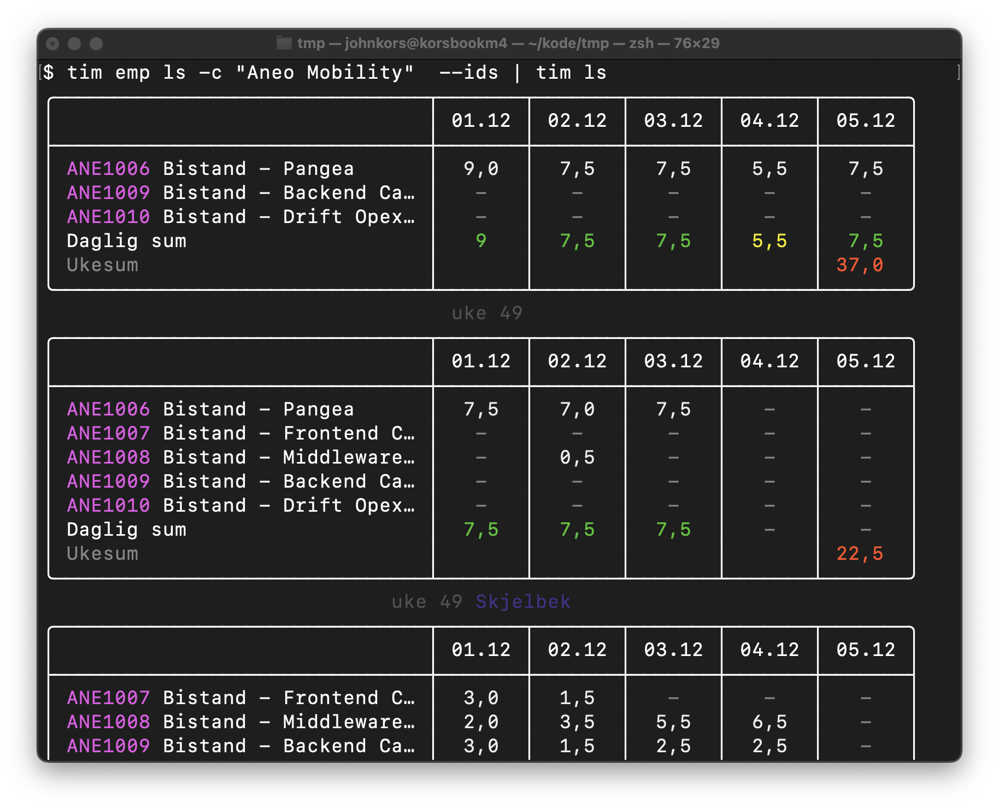
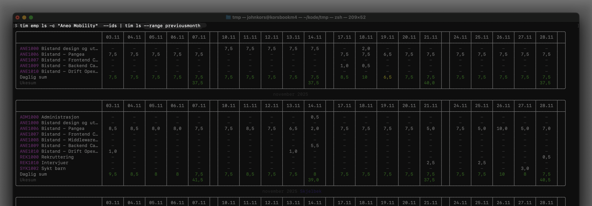
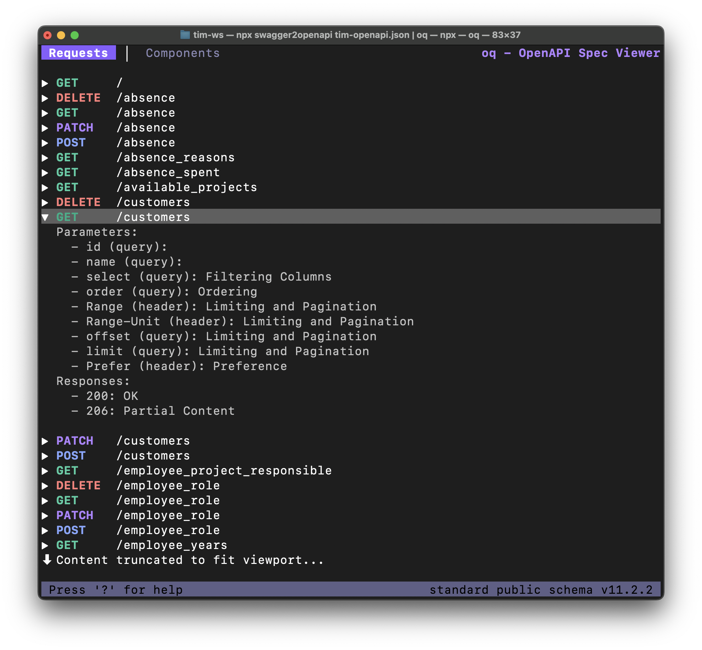

<div align="center">


### tim - timeføring cli for Blank

[](LICENSE)
[](https://github.com/blankoslo/tim)
[](https://www.blank.no/tim-the-incredible-machine)
[](https://www.google.com/search?q=tim+the+incredible+machine)

[features](#-features) • [installasjon](#-installasjon) • [ bruk](#-bruk)


</div>

## ✨ features

| **Feature**          | **Description**                                                                     |
|----------------------|-------------------------------------------------------------------------------------|
| **⏲️ Timeføring**    | Før timer for 1 dag, hele uka, eller hele måneden                                   |
| **🗓️ Rapporter**    | Gjennomgå timeføring for deg selv, eller alle hos din kunde/prosjekt                |
| **🤓 Ingen browser** | Du slipper browserens tamme klør                                                    |
| **🌊 Pipe-støtte**   | Kombiner med andre CLI-verktøy for avanserte arbeidsflyter                          |
| **🕊️ cURL**         | Støtte for å cURL'e fritt mot PostgREST-APIet dersom du ønsker å gå ned på metallet |


## 🚀 installasjon

```bash
# Homebrew
brew tap blankoslo/tools git@github.com:blankoslo/homebrew-tools.git
brew install blankoslo/tools/tim
```

_Valgfritt_: Bruk `tim` i Claude Code via [Blank sitt claude-marketplace](https://github.com/blankoslo/claude-marketplace). Skillen gir Claude et grunnkurs i `tim`,  så **du** slipper :) .

```bash
/plugin marketplace add blankoslo/claude-marketplace
/plugin install tim
```


## 💻 bruk

```bash
# Skriv 7.5 timer på prosjekt ANE1006 for i dag
tim write -p ANE1006

# Skriv 7.5 timer på default-prosjekt for i dag
tim set-default ANE1006
tim write

# Skriv 3.5 timer istedet for defaulten 7,5, idag
tim write 3,5

# Vis ukesrapport for alle hos kunden 'Aneo Mobility'
tim emp ls -c "Aneo Mobility" --ids | tim ls

# Vis ansattrapport for alle hos kunden 'Aneo Mobility' for forrige måned
tim emp ls -c "Aneo Mobility" --ids | tim ls --range PreviousMonth

# Vis prosjekter
tim projects -c "Aneo Mobility"

# Vis prosjekt-timeføring:
tim projects -c "Aneo Mobility" --ids | tim projects time -r PreviousMonth

# Last ned CSV-rapport-filene fra Floq reports APIet som brukes som vedlegg til kundefaktura:
tim projects -c "Aneo Mobility" --ids | tim reports project-employee-hours -r previousmonth
```

<div align="center">

</div>


<div align="center">

</div>

# tim curl

`tim curl` gjør requests rett mot PostgREST APIet med innloggede credentials.

```bash
# Hva er det dissa folka driver med egentlig?
tim curl '/employees?select=first_name,last_name&role=eq.Annet&termination_date=is.null'

# -x POST for å kalle RPC-metoder:
$ tim curl -x post '/rpc/employees_on_projects' \
 --data '{ "from_date": "2025-11-01", "to_date":"2025-11-30"}' | grep "Ruter"

# Finne timeføringa til alle Mags
tim curl '/employees?select=id&first_name=like.*Mag*'  | jq -r '.[].id' | tim ls

╭──────────────────────────────┬───────┬───────┬───────┬───────┬───────╮
│                              │ 01.12 │ 02.12 │ 03.12 │ 04.12 │ 05.12 │
├──────────────────────────────┼───────┼───────┼───────┼───────┼───────┤
│ SAL1000 Salg & markedsføring │  7,5  │  7,5  │  7,5  │  7,5  │  7,5  │
│ Daglig sum                   │  7,5  │  7,5  │  7,5  │  7,5  │  7,5  │
│ Ukesum                       │       │       │       │       │ 37,5  │
╰──────────────────────────────┴───────┴───────┴───────┴───────┴───────╯
                              uke 49 Backer
╭───────────────────────────────┬───────┬───────┬───────┬───────┬───────╮
│                               │ 01.12 │ 02.12 │ 03.12 │ 04.12 │ 05.12 │
├───────────────────────────────┼───────┼───────┼───────┼───────┼───────┤
│ ADM1000 Administrasjon        │   -   │   -   │  4,5  │   -   │   -   │
│ SB11005 Teamleder BM Betalin… │  7,5  │  8,5  │  3,0  │  7,5  │  7,5  │
│ Daglig sum                    │  7,5  │  8,5  │  7,5  │  7,5  │  7,5  │
│ Ukesum                        │       │       │       │       │ 38,5  │
╰───────────────────────────────┴───────┴───────┴───────┴───────┴───────╯
                             uke 49 Davidsen
```

### Floq API tips

Floq har en [Swagger spec](https://api-prod.floq.no/) som du kan utforske. Denne _kan_ lastes opp
i https://editor.swagger.io/, men for å unngå browser-lus (🤮) , bruk [
`github.com/plutov/oq`]((https://github.com/plutov/oq))

```bash
brew install plutov/tap/oq
```

```bash
# Åpne Floq API i oq
tim curl '/' | npx swagger2openapi /dev/stdin | oq
```

<div align="center">

</div>


NB Man _kan_ også gå gi direkte mot Floq-API'et, MEN obs: da vises kun RPC-metodene.

```bash
npx swagger2openapi https://api-prod.floq.no/ | oq
```
